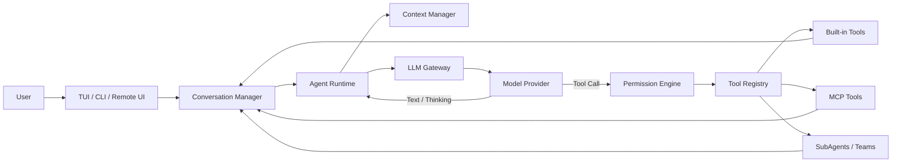

<div align="center">
  <h1>EvaCode</h1>
  <p><strong>Event-driven AI coding agent runtime for the terminal.</strong></p>
  <p>流式模型调用 · 工具执行 · 权限治理 · 上下文生命周期 · 多 Agent 协作</p>

  <p>
    
    
    
    
  </p>
</div>

## 项目概述

EvaCode 是我围绕 LLM Agent 工程化问题实现的个人项目。它不是对单次模型 API 的简单
封装，而是把模型流式响应、工具调用、权限决策、上下文压缩、长期记忆和多 Agent 协作
组织成一套可测试、可扩展的运行时。

项目提供三种共用同一 Agent 内核的入口：

- 基于 Textual 的终端交互界面；
- 面向脚本和 CI 的单次命令与 NDJSON 事件流；
- 基于 HTTP + WebSocket 的远程浏览器界面。

## 核心能力

| 领域 | 实现 |
| --- | --- |
| Agent Runtime | 异步事件流、工具循环、超限恢复、生命周期事件 |
| Model Gateway | Anthropic、OpenAI Responses、OpenAI-compatible Chat Completions |
| Tool System | Pydantic Schema、内置文件/命令工具、延迟发现、MCP 工具适配 |
| Permission Engine | 危险命令检测、路径边界、规则引擎、四种权限模式、HITL 审批 |
| Context Lifecycle | 真实 token 锚点、工具结果落盘、自动压缩、工作状态恢复 |
| Extensibility | Slash Commands、Skills、Hooks、MCP、项目级指令 |
| Multi-Agent | SubAgent、Trace、后台任务、共享任务、Mailbox、Agent Teams |
| Isolated Development | Git Worktree 创建、进入、退出和清理 |

## 系统架构



一次 Agent 迭代的主要过程：

1. 注入环境信息、项目指令和相关记忆；
2. 根据上下文预算处理过大的工具结果，并在必要时压缩历史；
3. 将统一消息结构转换为目标模型协议，发起流式请求；
4. 实时输出文本、思考、工具调用和 token 用量事件；
5. 对工具调用执行权限检查，安全调用可并行执行，需确认的调用顺序审批；
6. 将工具结果写回对话，继续下一轮；模型不再请求工具时结束。

更详细的设计说明见 [Architecture](docs/ARCHITECTURE.md)。

## 关键设计

### 事件驱动内核

`Agent.run()` 是异步生成器。TUI、Remote UI 和非交互命令只消费事件，不直接依赖厂商
SDK，因此界面层与模型、工具执行逻辑保持解耦。

### 协议适配层

各模型客户端把厂商事件统一为 `TextDelta`、`ThinkingDelta`、`ToolCallComplete` 和
`StreamEnd`。Agent 只处理内部事件，不需要感知 Anthropic Messages、OpenAI Responses
和 Chat Completions 之间的格式差异。

### Prompt 之外的权限边界

安全控制不依赖模型“自觉”。工具执行前依次经过危险命令、路径边界、显式规则、会话级
授权和权限模式判断；需要人工确认时通过事件交给界面层处理。

### 两层上下文治理

EvaCode 先限制单个工具结果对上下文的占用，并将完整内容落盘；当对话接近模型窗口时，
再生成结构化摘要，同时恢复最近文件读取和 Skill 调用等工作状态。

## 快速开始

### 环境要求

- Python 3.11+
- [uv](https://docs.astral.sh/uv/)

### 安装依赖

```bash
uv sync --frozen
```

### 创建本地配置

Linux / macOS：

```bash
cp .evacode/config.yaml.example .evacode/config.yaml
```

Windows PowerShell：

```powershell
Copy-Item .evacode/config.yaml.example .evacode/config.yaml
```

凭据通过环境变量提供，不要写入仓库：

```powershell
$env:OPENAI_API_KEY = "your-key"
# 或
$env:ANTHROPIC_API_KEY = "your-key"
```

### 运行

```bash
# Textual 终端界面
uv run evacode

# 单次任务
uv run evacode -p "概括当前仓库的模块边界"

# NDJSON 事件流
uv run evacode -p "检查当前项目" --output-format stream-json

# Remote UI
uv run evacode --remote
```

EvaCode 将启动命令所在目录作为工作目录。要分析其他项目，请先进入目标项目，再调用
EvaCode 的可执行文件。

## 配置

```yaml
providers:
  - name: local-or-cloud
    protocol: openai-compat
    base_url: https://api.example.com/v1
    model: your-model-name
    context_window: 128000
    max_output_tokens: 8192

permission_mode: default
mcp_servers: []
enable_coordinator_mode: false
```

配置按以下顺序合并，后面的文件优先级更高：

1. `~/.evacode/config.yaml`
2. `<workdir>/.evacode/config.yaml`
3. `<workdir>/.evacode/config.local.yaml`

支持的权限模式：

- `default`：读取自动放行，写入和命令按规则确认；
- `acceptEdits`：自动允许文件编辑，命令仍需检查；
- `plan`：限制为分析、规划和计划文件写入；
- `bypassPermissions`：跳过常规确认，仅建议在隔离环境使用。

## 测试与构建

```bash
# 全量测试
uv run pytest -q

# 权限系统回归测试
uv run pytest -q tests/test_permissions.py

# 构建 wheel 和源码包
uv build
```

默认测试使用 Mock Client，不需要真实 API Key，也不会调用付费模型服务。

## 仓库结构

```text
evacode/
├── evacode/
│   ├── __main__.py          # CLI 入口与运行模式选择
│   ├── agent.py             # 事件驱动 Agent 主循环
│   ├── client.py            # 模型协议适配
│   ├── conversation.py      # 统一消息和 token 状态
│   ├── context/             # 上下文预算、压缩与恢复
│   ├── tools/               # 工具抽象、注册表和内置工具
│   ├── permissions/         # 权限决策与路径/命令安全
│   ├── mcp/                 # MCP 客户端和工具包装
│   ├── memory/              # 项目指令、会话与长期记忆
│   ├── hooks/               # 生命周期 Hooks
│   ├── skills/              # Skill 发现与执行
│   ├── agents/              # SubAgent、任务和 Trace
│   ├── worktree/            # Git Worktree 隔离
│   └── teams/               # Agent Teams 与协作状态
├── tests/                   # 单元测试与回归测试
├── docs/                    # 架构和部署文档
├── .evacode/                # 无密钥配置模板
└── pyproject.toml
```

## 安全说明

- 不要提交 `.evacode/config.yaml`、`.env`、API Key、会话、记忆或调试日志。
- `-p` 是面向受控自动化环境的非交互模式；权限系统返回 `ask` 时会自动继续，但明确
  `deny` 的危险命令仍会被拒绝。
- Remote UI 当前没有内置身份认证并监听 `0.0.0.0:18888`，请仅在受信网络中使用，
  或通过反向代理增加认证与 TLS。
- MCP Server、第三方 Skill 和 Hooks 都可能执行外部代码，启用前应完成审查。

更多部署边界见 [Security Policy](SECURITY.md) 和 [Deployment](docs/DEPLOYMENT.md)。

## Roadmap

- Remote UI 身份认证与会话令牌；
- Windows 原生沙箱支持；
- 更完整的 provider contract tests；
- Agent 运行指标与可视化 Trace；
- 可插拔的 token estimator 和持久化后端。

## 项目状态

这是一个持续迭代的个人工程项目，重点验证 Agent Runtime 的模块边界、安全控制和可测试
设计。它包含真实的文件写入、命令执行及远程访问能力，在生产环境使用前请自行完成权限
隔离、审计和备份。

## License

[MIT](LICENSE)
