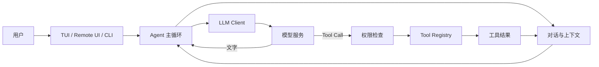

<div align="center">
  <h1>EvaCode</h1>
  <p><strong>A terminal-first AI coding assistant built for learning and experimentation.</strong></p>
  <p>支持工具调用、权限控制、MCP、上下文压缩、记忆、Skills、Hooks、SubAgents、Worktrees 与 Agent Teams。</p>

  <p>
    
    
    
  </p>
</div>

---

## 项目简介

EvaCode 是一个以终端为主要交互界面的 AI 编程助手学习项目。它把大模型流式输出、
工具调用、权限审批、长期记忆和多 Agent 协作组织在一套可阅读、可测试、可扩展的
Python 代码中。

这个仓库适合两类使用方式：

- 作为编程助手运行，连接 Anthropic、OpenAI 或 OpenAI-compatible 模型服务。
- 作为 Agent 工程学习项目，研究从单轮聊天到工具循环、多 Agent 团队的完整实现。

## 核心能力

### 多种运行方式

- Textual 终端交互界面。
- `-p` 非交互单次任务与 NDJSON 事件流。
- 基于 HTTP + WebSocket 的浏览器远程界面。

### 模型与工具

- 支持 `anthropic`、`openai` 和 `openai-compat` 协议。
- 内置 ReadFile、WriteFile、EditFile、Bash、Glob、Grep 等工具。
- 使用 Pydantic 参数模型自动生成 Tool Schema。
- 支持延迟发现工具和 MCP 外部工具。

### 安全与上下文

- `default`、`acceptEdits`、`plan`、`bypassPermissions` 四种权限模式。
- 危险命令检测、路径限制、权限规则和可选 OS 沙箱。
- 工具结果持久化、token 估算、自动上下文压缩与恢复状态。

### Agent 扩展

- 项目指令与长期记忆。
- Slash Commands、Skills 和生命周期 Hooks。
- SubAgent 任务分发、Trace 和通知。
- Git Worktree 隔离开发。
- Agent Teams、共享任务、邮箱和进度管理。

## 工作原理



模型没有请求工具时，本轮结束；模型请求工具时，EvaCode 校验权限、执行工具、把结果
加入对话，再进入下一轮模型调用。

## 项目结构

```text
eva/
├── evacode/                 # 主 Python 包
│   ├── __main__.py          # CLI 入口
│   ├── agent.py             # Agent 主循环
│   ├── app.py               # Textual UI
│   ├── client.py            # 模型客户端
│   ├── config.py            # 配置加载
│   ├── context/             # 上下文预算与压缩
│   ├── permissions/         # 权限、规则与危险命令检测
│   ├── tools/               # 内置工具与 Tool Registry
│   ├── mcp/                 # MCP 客户端与工具包装
│   ├── memory/              # 指令、记忆与会话
│   ├── skills/              # Skill 加载与执行
│   ├── hooks/               # 生命周期 Hooks
│   ├── agents/              # SubAgent
│   ├── worktree/            # Git Worktree
│   └── teams/               # Agent Teams
├── tests/                   # pytest 测试
├── .evacode/
│   ├── config.yaml.example  # 无密钥配置模板
│   └── skills/              # 随仓库提供的示例 Skills
├── docs/                    # 学习与部署文档
├── pyproject.toml
└── uv.lock
```

运行时生成的配置、日志、会话、缓存、虚拟环境和构建产物均已被 `.gitignore` 排除。

## 快速开始

### 1. 获取代码

```bash
git clone <your-repository-url>
cd eva
```

### 2. 安装 uv 和依赖

```bash
curl -LsSf https://astral.sh/uv/install.sh | sh
uv sync --frozen --no-dev
```

也可以使用普通虚拟环境：

```bash
python3.11 -m venv .venv
source .venv/bin/activate
python -m pip install -e .
```

### 3. 创建本地配置

```bash
cp .evacode/config.yaml.example .evacode/config.yaml
```

编辑 `.evacode/config.yaml`，填写自己的模型地址与模型名。模板只使用示例地址，不包含
任何真实 API Key。

通过环境变量提供凭据：

```bash
# openai 或 openai-compat
export OPENAI_API_KEY='your-key'

# anthropic
export ANTHROPIC_API_KEY='your-key'
```

对于不校验 Key 的本地 OpenAI-compatible 服务，也需要提供一个非空占位值：

```bash
export OPENAI_API_KEY='local-not-used'
```

### 4. 启动

```bash
# 终端界面
uv run evacode

# 单次任务
uv run evacode -p '只读取当前项目并概括目录结构'

# 输出 NDJSON 事件
uv run evacode -p '检查当前项目' --output-format stream-json

# 浏览器界面，监听 18888
uv run evacode --remote
```

EvaCode 把启动命令所在目录作为工作目录。要操作其他项目，请先进入目标项目，再使用
EvaCode 的绝对路径启动：

```bash
cd /path/to/your-project
/path/to/eva/.venv/bin/evacode
```

## 配置示例

```yaml
providers:
  - name: openai-compatible
    protocol: openai-compat
    base_url: https://api.example.com/v1
    model: your-model-name
    context_window: 128000
    max_output_tokens: 8192

permission_mode: default
mcp_servers: []
enable_coordinator_mode: false
```

配置加载顺序：

1. `~/.evacode/config.yaml`
2. 当前工作目录的 `.evacode/config.yaml`
3. 当前工作目录的 `.evacode/config.local.yaml`

后面的配置具有更高优先级。

## 常用命令

在交互界面中输入：

```text
/help          查看命令
/status        查看状态与 token 用量
/permission    切换权限模式
/plan          进入规划模式
/compact       手动压缩上下文
/memory        查看或管理记忆
/skill         查看 Skills
/mcp           查看 MCP 状态
/session       管理会话
/tasks         查看 SubAgent 任务
/worktree      管理工作树
```

## 开发与测试

```bash
# 安装开发依赖
uv sync --frozen

# 全部测试
uv run pytest -q

# 单个模块
uv run pytest -q tests/test_permissions.py

# 构建 wheel 和源码包
uv build
```

新增 Tool、权限规则、Hook 或 Agent 行为时，请同时补充对应测试。更多约定见
[CONTRIBUTING.md](CONTRIBUTING.md)。

## 文档

- [小白学习教程](docs/BEGINNER_GUIDE.md)：从 Python 基础到 Agent Teams 的循序学习路线。
- [Linux 部署教程](docs/DEPLOYMENT.md)：迁移、配置、systemd 与离线安装。
- [项目指令](EVACODE.md)：本仓库自身的开发约定。
- [安全说明](SECURITY.md)：凭据、远程 UI 和漏洞报告注意事项。

## 安全提示

- 不要提交 `.evacode/config.yaml`、`.env`、API Key、会话、记忆或调试日志。
- 默认使用 `permission_mode: default`，谨慎使用 `bypassPermissions`。
- Remote UI 当前没有内置身份认证，并监听 `0.0.0.0:18888`；不要直接暴露到公网。
- MCP Server 和第三方 Skill 都属于外部代码或外部服务，启用前应先审查。

## 项目定位

EvaCode 当前主要用于学习和实验。它包含真实的文件写入、命令执行和多 Agent 能力，
在重要或生产环境使用前应自行完成安全评估、权限隔离和备份。

## License

本项目采用 MIT License，详见仓库根目录下的 `LICENSE` 文件。
`.evacode/skills/` 中的第三方内容保留各自的许可证文件。
