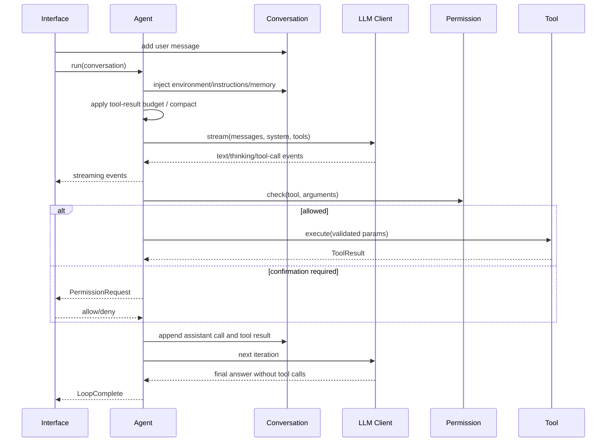

# EvaCode Architecture

本文描述 EvaCode 的运行时边界、核心数据流和主要工程取舍。内容面向代码审查者和希望
扩展项目的开发者。

## 1. Design goals

EvaCode 主要解决五个问题：

1. 用统一事件模型隔离不同 LLM Provider 的协议差异；
2. 让工具调用具备明确的参数校验、权限边界和执行结果；
3. 在长任务中控制工具输出和历史消息对上下文窗口的占用；
4. 让 TUI、CLI 和 Remote UI 共享同一个 Agent Runtime；
5. 在不破坏单 Agent 模型的前提下支持 SubAgent、Worktree 和 Agent Teams。

非目标：

- 不在核心层绑定某一个模型厂商；
- 不把 Prompt 当作唯一安全边界；
- 不假设模型输出、工具参数或外部 MCP Server 永远可信；
- 不把远程界面定位为可直接暴露公网的托管服务。

## 2. Component map

```text
Interfaces
  ├─ Textual App
  ├─ Non-interactive CLI
  └─ Remote HTTP/WebSocket
          │
          ▼
Agent Runtime ───── Conversation Manager
    │                     │
    ├─ LLM Client         ├─ token usage anchor
    ├─ Tool Registry      ├─ tool call/result state
    ├─ Permission Engine  └─ environment/memory injection
    ├─ Context Manager
    └─ Lifecycle Hooks
          │
          ├─ Built-in Tools / MCP
          ├─ Memory / Skills
          ├─ SubAgents / Trace
          └─ Worktrees / Teams
```

### Interfaces

`evacode/__main__.py` 选择非交互、Remote 或 TUI 模式。三个入口负责组装依赖和消费事件，
不复制 Agent 的核心循环。

### Conversation Manager

`ConversationManager` 保存内部统一消息结构。除了文本，它还保留 thinking block、tool use、
tool result 和 API 返回的真实 token 用量锚点。Provider 客户端只读取该结构并转换协议。

### Agent Runtime

`Agent.run()` 是系统核心。它是一个异步生成器，向界面层发送文本、思考、工具调用、工具
结果、权限请求、重试、压缩和完成事件。

### Provider clients

所有客户端实现相同的 `LLMClient.stream()` 接口：

- `AnthropicClient`：Anthropic Messages API；
- `OpenAIClient`：OpenAI Responses API；
- `OpenAICompatClient`：Chat Completions 兼容服务。

客户端负责协议序列化、流式 delta 合并、异常归一化和 usage 提取，不负责工具执行。

## 3. Runtime sequence



## 4. Event model

模型客户端输出底层 `StreamEvent`：

- `TextDelta`
- `ThinkingDelta` / `ThinkingComplete`
- `ToolCallStart` / `ToolCallDelta` / `ToolCallComplete`
- `StreamEnd`

Agent 将其转换为面向界面的 `AgentEvent`。这样可以做到：

- TUI 实时渲染文本和工具状态；
- CLI 输出稳定的 NDJSON；
- 测试通过 Mock Client 精确构造事件序列；
- Provider 适配变化不扩散到 UI。

## 5. Tool execution and permissions

每个工具继承 `Tool`，使用 Pydantic 模型描述参数，并声明分类：

- `read`
- `write`
- `command`

`ToolRegistry` 负责注册、启用、禁用、Schema 输出和延迟工具发现。MCP 工具通过
`MCPToolWrapper` 适配为相同接口。

权限检查顺序：

1. Plan 模式允许列表；
2. 安全只读命令；
3. 危险命令拒绝；
4. 可选 OS 沙箱；
5. 文件路径边界；
6. 用户、项目和本地规则；
7. 会话级授权；
8. 当前权限模式；
9. Human-in-the-loop 确认。

安全并发工具可以在模型仍然输出时开始执行，需要交互确认的工具会延迟到流结束后顺序
执行，避免并发权限对话。

## 6. Context lifecycle

上下文治理分为两层。

### Layer 1: tool-result budget

过大的工具结果会完整保存到 `.evacode/session/tool-results/`，对话中只保留稳定预览和文件位置。
替换记录单独持久化，防止恢复后重复截断。

### Layer 2: conversation compaction

当 token 估算接近 context window 阈值时，Context Manager 对较早历史生成摘要，同时保留
最近完整轮次。压缩后重新注入环境、项目指令、记忆和恢复附件。

`ConversationManager` 使用 Provider usage 作为真实锚点，只对锚点之后追加的本地消息执行
字符估算，降低纯启发式 token 估算的累计误差。

## 7. Extension model

- **Project instructions**：从工作目录和 Git 根目录加载 `EVACODE.md` 等项目约束；
- **Slash Commands**：由注册表和 handler 组成，避免 UI 中出现大量条件分支；
- **Skills**：按需加载的提示和资源包；
- **Hooks**：在 session、turn、send、receive 和 tool 生命周期执行动作；
- **MCP**：支持 stdio 和 HTTP Server，并把外部 Schema 转为本地 Tool；
- **SubAgents**：通过 Agent 定义、工具过滤、任务状态和 Trace 运行；
- **Agent Teams**：在 SubAgent 之上增加成员、Mailbox、共享任务和持续协作。

## 8. Failure handling

运行时显式处理以下错误：

- 认证、限流和网络异常；
- 输出 token 上限与续写恢复；
- 未知工具连续调用；
- 工具参数校验和执行异常；
- 自动压缩失败与熔断；
- Hook 拒绝和权限拒绝；
- 子任务、Worktree 和 Team 清理失败。

工具错误以结构化结果返回模型，不会被伪装成普通文本成功响应。

## 9. Test strategy

测试集中覆盖：

- Agent 事件顺序和工具循环；
- Provider context window 解析；
- 权限规则、危险命令和路径边界；
- 工具结果预算、压缩、恢复和序列化；
- Hooks、Skills 和 MCP 包装；
- SubAgent、Worktree、Mailbox、共享任务与 Agent Teams。

测试默认使用 Mock Client 和临时目录，不依赖真实模型服务。CI 在 Python 3.11 环境执行
`uv sync --frozen` 和 `uv run pytest -q`。
